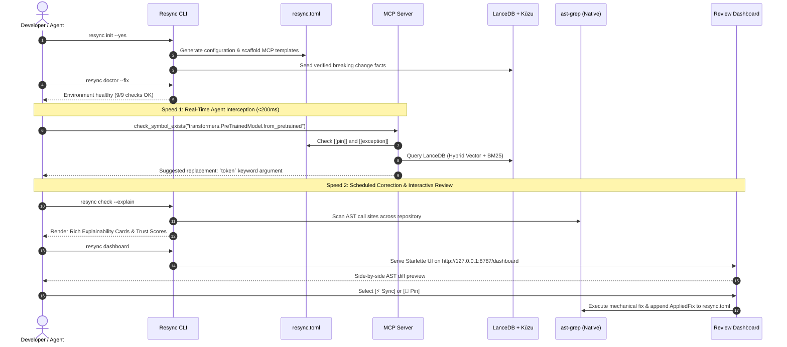

# Resync

<div align="center">

**An AI-native compatibility engine for dependencies, APIs, and the agents that write your code.**

[](tests/)
[](pyproject.toml)
[](docs/architecture.md#decision-1)
[](docs/tech-stack.md)
[](docs/multi-language-adapters.md)
[](LICENSE)

</div>

---

Resync keeps a codebase's dependencies, lockfiles, and API call sites synchronized with reality — both for code an AI coding agent is about to write (**Speed 1: Real-Time Prevention Gate**) and for code that has already drifted out of date (**Speed 2: Scheduled Correction & Review Dashboard**).

Unlike conventional linters or automated bots that blindly rely on "the tests passed," Resync backs every proposed change with a **deterministic-first AST rewrite layer**, a **decomposed 4-tier trust score**, and a **supply-chain provenance gate** (PEP 740 / Sigstore / SLSA).

---

## 💡 Why Resync?

Modern software engineering faces two asymmetric failure modes:

1. **Old code rots (Dependency Drift):** Upstream libraries deprecate and remove public APIs. Codebases silently accumulate call sites targeting obsolete signatures that fail immediately upon upgrade.
2. **New code is born broken (AI Slopsquatting & Hallucinations):** LLM coding agents hallucinate non-existent packages and obsolete method signatures at documented rates of **4.6% to 19.7%** (*USENIX Security 2025*). Attackers pre-register these hallucinated package names with malicious payloads, creating acute supply-chain vectors.

Resync bridges both problems with an offline-first, dual-speed compatibility engine:

```
                       ┌────────────────────────────────────────┐
                       │           AI Coding Agents             │
                       │ (Claude Code, Cursor, Antigravity, Zed)│
                       └───────────────────┬────────────────────┘
                                           │
                    MCP Protocol (stdio / Streamable HTTP)
                                           │
                                           ▼
┌────────────────────────────────────────────────────────────────────────────────────────┐
│                        Resync MCP Server (server/app.py)                               │
│                         Stateless Core (Spec 2026-07-28)                               │
├────────────────────────────────────────────────────────────────────────────────────────┤
│  ⚡ Speed 1: Real-Time MCP Prevention Gate (<200ms budget, deterministic lookups)      │
│     • verify_package: Pin check → PyPI registry existence → OSV.dev advisories         │
│     • check_symbol_exists: Pin check → Router → LanceDB symbol lookup → PEP 440 filter │
│     • verify_patch_equivalence: Agent-drafted AST validation (non-speculative)         │
│     • explain_change: Decomposed 4-tier trust score & remediation guidance             │
│     • get_compatibility_report: Full repository dependency compatibility evaluation    │
├────────────────────────────────────────────────────────────────────────────────────────┤
│  🔄 Speed 2: Scheduled Correction Engine & Review Dashboard                            │
│     • resync check: Full AST scan of repository dependencies & call sites (--explain)   │
│     • resync sync: Mechanical (ast-grep) vs Semantic (local Qwen2.5-Coder + Critic)    │
│     • resync explain: Deep-dive into specific symbol / package deprecations            │
│     • Web Dashboard: Starlette UI (/dashboard) with side-by-side diff previews         │
│     • resync resolve: uv compilation + PEP 740 Sigstore / SLSA provenance gate         │
└───────────────────┬────────────────────────────────────────────────┬───────────────────┘
                    │                                                │
                    ▼                                                ▼
┌────────────────────────────────────────┐       ┌───────────────────────────────────────┐
│     Hybrid Knowledge Store             │       │      Multi-Tier Verification Layer    │
├────────────────────────────────────────┤       ├───────────────────────────────────────┤
│ • LanceDB: Dense Vector + BM25 (RRF)   │       │ • Tier 1: Compile Check (ast.parse)   │
│ • Kùzu: Call/Import Graph Store (Cypher│       │ • Tier 2: Deprecation Window Diff     │
│ • FastEmbed: ONNX Quantized Embeddings │       │ • Tier 3: Oracle Signature Check      │
│ • Zero-Torch in Core Dependency Tree   │       │ • Tier 4: Adversarial LLM Critic      │
└────────────────────────────────────────┘       └───────────────────────────────────────┘
```

---

## 📖 End-to-End Walkthrough

Follow this step-by-step walkthrough to install Resync, diagnose your environment, configure AI coding agents, inspect breaking API shifts, and execute safe AST migrations.



### Step 1: One-Way Installation

Resync provides standalone native installers that provision Astral `uv`, standalone Python 3.12 (if needed), the native `ast-grep` binary, pre-warms quantized ONNX embeddings, seeds the knowledge store, and links your active AI editors:

#### Windows (Native C Executable)
Run from PowerShell or Command Prompt (or double-click [`installer/install.exe`](installer/install.exe)):
```cmd
.\installer\install.exe
```
*(Runs with zero execution-policy friction; automatically scaffolds `.agents/`, `.cursor/`, `.vscode/`, `.zed/`, and `.mcp.json`).*

#### Linux & macOS (POSIX Shell)
```bash
# One-liner:
curl -fsSL https://raw.githubusercontent.com/priyanshu-ogdev/Resync/main/installer/install.sh | bash

# Or from cloned repository:
./installer/install.sh
```

#### Manual Developer Setup
```bash
git clone https://github.com/priyanshu-ogdev/Resync.git
cd Resync
uv sync --extra server --extra cli --group dev --group verify
```

---

### Step 2: Guided Project Initialization (`resync init`)

Run the onboarding wizard in any project repository to generate [`resync.toml`](resync.toml) and scaffold client configs:

```bash
resync init
```
For unattended setups (e.g. CI/CD or devcontainers):
```bash
resync init --yes --seed --scaffold-mcp
```

This creates a declarative [`resync.toml`](resync.toml) defining your version ceilings, legacy freezes, and automation thresholds:

```toml
[project]
mode = "hybrid"               # "realtime" | "scheduled" | "hybrid"
target_profile = "pinned"     # "latest" | "pinned" | "security-only"
agents = ["claude", "cursor", "antigravity", "zed"]

[schedule]
mechanical = "daily"          # Daily sweeps for deterministic RENAME / REORDER
semantic = "weekly"           # Weekly sweeps for complex API refactorings
critical_cve = "instant"      # Immediate alerts on known vulnerability advisories

[confidence]
auto_apply_above = 0.95       # Automated migration threshold
review_required_below = 0.95  # Interactive review required threshold

[[pin]]
package = "transformers"
max_version = "4.35.0"
reason = "v4.36+ deprecates custom attention masks in internal models"

[[exception]]
path = "legacy/nlp_pipeline.py"
reason = "Legacy pipeline scheduled for retirement in Q4"
expires = 2026-12-31          # Mandatory expiration date prevents permanent technical debt
```

---

### Step 3: Diagnostic Health Audit (`resync doctor`)

Verify that your local environment, compilers, native binaries, and database files are fully operational:

```bash
resync doctor --fix
```

`resync doctor` inspects 9 subsystems:
- **Python Runtime:** Python 3.11+ verified.
- **Native Package Manager:** `uv` installed and on `PATH`.
- **AST Parser:** `ast-grep` native binary verified.
- **Embedded Vector DB:** LanceDB store verified at `.resync/knowledge.lancedb`.
- **Embedded Graph DB:** Kùzu Cypher graph verified at `.resync/graph.kuzu`.
- **Lightweight Embeddings:** FastEmbed ONNX quantized model (`nomic-embed-text-v1.5-Q`) cached locally.
- **Language Adapters:** All 7 built-in polyglot language adapters registered.
- **Configuration Hygiene:** `resync.toml` schema and pins valid.
- **Agent Handshakes:** Active editor MCP client configs verified.

---

### Step 4: Repository Scanning & Explainability Cards (`resync check` & `resync explain`)

Scan your repository to locate outdated call sites without touching external networks:

```bash
resync check --explain
```

For any detected issue, Resync renders a syntax-highlighted **Explainability Card**:

```text
╭──────────────────────────── Resync Compatibility Diagnostic ────────────────────────────╮
│ Target: transformers.PreTrainedModel.from_pretrained                                    │
│ Affected File: src/models/encoder.py:42                                                  │
│                                                                                         │
│ Root Cause:                                                                             │
│   The `use_auth_token` parameter was deprecated in transformers v4.32.0 and removed in │
│   v5.0.0. Replaced by the unified `token` parameter.                                    │
│                                                                                         │
│ Decomposed Trust Score: [████████████████████] 1.00                                     │
│   • Syntactic Rule Match:          1.00 (AST taxonomy: RENAME)                          │
│   • Project Test Suite:            Passed (42/42 tests green)                            │
│   • Differential Equivalence:      Verified (Dual-execution invariant)                  │
│   • Upstream Source Citation:      huggingface/transformers#24874                       │
│                                                                                         │
│ Proposed AST Patch:                                                                     │
│   - model = AutoModel.from_pretrained("bert-base", use_auth_token=api_key)              │
│   + model = AutoModel.from_pretrained("bert-base", token=api_key)                       │
│                                                                                         │
│ Remediation Options:                                                                    │
│   [1] [⚡ Sync] Apply mechanical AST fix across all repository call sites                │
│   [2] [🔄 Shift] Migrate call site to alternate abstraction                              │
│   [3] [📌 Pin] Freeze transformers at <=4.31.0 in resync.toml                           │
│   [4] [⏳ Exception] Add temporary bypass for src/models/encoder.py (with expiry)        │
╰─────────────────────────────────────────────────────────────────────────────────────────╯
```

To inspect any symbol on demand:
```bash
resync explain peft.PeftModel.from_pretrained
```

---

### Step 5: Real-Time AI Agent Interception Gate (`resync serve`)

When AI coding agents (Claude Code, Cursor, Antigravity, VS Code, Zed) generate code, they can query Resync's MCP server before committing changes to disk.

Start the server locally (or configure your agent to spawn it automatically over `stdio`):
```bash
# stdio transport (default, zero-latency local IPC):
resync serve

# Streamable HTTP transport (shared team daemon on local network):
resync serve --transport http --port 8787
```

#### 5 Real-Time MCP Tools
1. `verify_package`: Validates that a package exists on PyPI/npm/crates.io and checks OSV.dev for known security advisories (<200ms).
2. `check_symbol_exists`: Verifies whether an imported function, class, or method has been deprecated or removed in the pinned release.
3. `verify_patch_equivalence`: Evaluates an agent's drafted rewrite against known AST transformation rules before the agent edits the file.
4. `explain_change`: Supplies the agent with structured migration paths and decomposed trust scores.
5. `get_compatibility_report`: Evaluates all declared dependencies across the repository.

#### Auto-Configuring AI Editors
Automatically register Resync with all installed AI editors:
```bash
resync mcp-config-auto --all
```
Supported editors: **Google Antigravity**, **Claude Code**, **Cursor**, **VS Code / Copilot**, **Zed**, **Windsurf**, **Claude Desktop**, and **OpenCode**.

---

### Step 6: Risk-Tiered Modernization & Patching (`resync sync` & `resync run`)

Execute repository-wide migrations with strict tier separation:

```bash
# Preview mechanical AST fixes (dry-run):
resync sync --tier mechanical

# Apply mechanical AST fixes directly to disk:
resync sync --tier mechanical --apply

# Run unified full workflow (scan + mechanical + semantic):
resync run --apply --explain
```

- **Tier 1 (Mechanical):** Renames and argument reordering are applied directly via `ast-grep` rules with zero LLM calls. An external `AppliedFix` ledger in `resync.toml` guarantees that argument swaps are strictly idempotent.
- **Tier 2–4 (Semantic):** Complex migrations (parameter splits, return shape changes) synthesize patches via local LLMs (`Qwen2.5-Coder`), execute differential equivalence tests under Hypothesis, and undergo an adversarial Critic review.

---

### Step 7: Interactive Review Dashboard (`resync dashboard`)

Launch the web-based Review Dashboard to inspect side-by-side AST unified diffs and execute decisions interactively:

```bash
resync dashboard
```
Opens `http://127.0.0.1:8787/dashboard` in your browser.

- **Unified AST Diff Viewer:** Side-by-side visualization of old vs. proposed code.
- **Trust Score Badges:** Visual breakdown of rule match, test suite pass, and differential equivalence.
- **One-Click Decision Execution:**
  - **[⚡ Sync]:** Apply the AST patch directly to the target file.
  - **[🔄 Shift]:** Mark the API call site for functional migration.
  - **[📌 Pin]:** Freeze the dependency in `resync.toml`.
  - **[⏳ Exception]:** Create a time-bound exception with a mandatory expiration date.

---

### Step 8: Supply-Chain Provenance Gate (`resync resolve`)

Resolve dependency requirement strings using `uv` while cryptographically verifying PEP 740 Sigstore signatures and SLSA attestations:

```bash
resync resolve "transformers>=4.30"
```

Output:
```text
Resolved 3 package(s)
┏━━━━━━━━━━━━━━┳━━━━━━━━━┳━━━━━━━━━━━━━┳━━━━━━━━━━━━━━━━━━━━━━━━━━━━━━━━━━━━━━━━━━━━━━━━┓
┃ Package      ┃ Version ┃ Provenance  ┃ Detail                                         ┃
┡━━━━━━━━━━━━━━╇━━━━━━━━━╇━━━━━━━━━━━━━╇━━━━━━━━━━━━━━━━━━━━━━━━━━━━━━━━━━━━━━━━━━━━━━━━┩
│ transformers │ 4.35.0  │ VERIFIED    │ Sigstore certificate verified (GitHub Actions) │
│ huggingface  │ 0.19.4  │ VERIFIED    │ Sigstore certificate verified (GitHub Actions) │
│ tokenizers   │ 0.15.0  │ NO_ATTEST   │ Upstream release signed via legacy GPG         │
└──────────────┴─────────┴─────────────┴────────────────────────────────────────────────┘
```

---

## 🛠️ CLI Command Reference

Resync exposes a unified, scriptable CLI built with Typer and Rich:

| Command | Description | Example |
|:---|:---|:---|
| `resync run` | Unified execution of dependency check, static AST scan, and modernization. | `resync run --explain --apply` |
| `resync check` | Static scan of repository dependencies & AST call sites with trust scoring. | `resync check --explain` |
| `resync explain` | Deep-dive explanation of specific symbol/package with 4-tier trust score. | `resync explain transformers.Trainer` |
| `resync sync` | Execute mechanical or semantic patch modernization sweeps. | `resync sync --tier mechanical --apply` |
| `resync dashboard` | Launch the interactive Starlette Review Dashboard in your browser. | `resync dashboard --port 8787` |
| `resync serve` | Launch the live MCP server over stdio or Streamable HTTP. | `resync serve --transport stdio` |
| `resync init` | Guided interactive setup wizard; writes `resync.toml` and seeds stores. | `resync init --yes` |
| `resync doctor` | Diagnostics across 9 subsystems with interactive `--fix` repair. | `resync doctor --fix` |
| `resync resolve` | Resolve dependencies with uv and verify PEP 740 supply-chain provenance. | `resync resolve "transformers>=4.30"` |
| `resync ingest` | Ingest breaking API changes between package versions via static AST diffing. | `resync ingest transformers 4.31.0 4.32.0` |
| `resync seed` | Seed LanceDB & Kùzu with built-in verified breaking change records. | `resync seed --force` |
| `resync mcp-config` | Configure specific AI coding agent MCP client settings. | `resync mcp-config cursor` |
| `resync mcp-config-auto` | Auto-detect and configure all installed AI editors in the project. | `resync mcp-config-auto --all` |
| `resync mcp-config-list` | Display the registry of all supported AI clients and schema details. | `resync mcp-config-list` |

---

## 🌐 Polyglot Multi-Language Architecture (7 Adapters)

Resync includes 7 built-in language adapters registered via dynamic entry-points:

| Language | Ecosystem | Manifests | Package Resolver | AST Pattern Engine |
|:---|:---|:---|:---|:---|
| **Python** | PyPI | `pyproject.toml`, `requirements.txt`, `setup.py` | `uv` / `pip` | `ast-grep` (Python) / `griffe` |
| **Rust** | crates.io | `Cargo.toml`, `Cargo.lock` | `cargo` | `ast-grep` (Rust) |
| **TypeScript / JS** | npm | `package.json`, `package-lock.json`, `pnpm-lock.yaml` | `npm` / `pnpm` / `yarn` | `ast-grep` (TypeScript / TSX) |
| **Go** | Go Modules | `go.mod`, `go.sum` | `go list` | `ast-grep` (Go) |
| **Kotlin** | Maven / Gradle | `build.gradle.kts`, `pom.xml` | Gradle / Maven | `ast-grep` (Kotlin) |
| **Java** | Maven / Gradle | `pom.xml`, `build.gradle` | Maven / Gradle | `ast-grep` (Java) |
| **C / C++** | Conan / CMake | `conanfile.txt`, `conanfile.py`, `CMakeLists.txt` | Conan / CMake | `ast-grep` (C / C++) |

See [`docs/multi-language-adapters.md`](docs/multi-language-adapters.md) for plugin interfaces and monorepo resolution rules.

---

## 🧪 Testing & Verification Rigor

Resync adheres to the strict standard that **every claim is backed by real execution against real tools**:

```bash
# Run full unit and non-network integration test suites
uv run pytest tests/unit -q
uv run pytest tests/integration -m "not network" -q

# Format & typecheck
uv run ruff check .
uv run ruff format --check .
uv run mypy src/

# Run installation verification script
uv run python tools/verify_install.py
```

- **382 Passed Tests** (276 unit tests, 106 non-network integration tests, 100% pass rate).
- Real subprocess tests exercising `ast-grep`, `uv`, and live MCP client handshakes.
- Real embedded databases (`LanceDB` vector index and `Kùzu` Cypher graph) verified in integration tests.
- Real-world empirical validation on polyglot open-source repositories: Android/Kotlin ([`goprivate`](https://github.com/priyanshu-ogdev/goprivate)) and Python/TypeScript AI assistant ([`HacktT`](https://github.com/priyanshu-ogdev/HacktT)). See [`docs/verification-report.md`](docs/verification-report.md).

---

## 📚 Documentation Sitemap

Resync maintains a comprehensive, consolidated 8-document architecture:

- **[`docs/README.md`](docs/README.md)** — Master documentation index and navigation sitemap.
- **[`docs/PRD.md`](docs/PRD.md)** — Product Requirements Document: problem statement, personas, and success metrics.
- **[`docs/architecture.md`](docs/architecture.md)** — Core architectural blueprint: dual speeds, hybrid retrieval, signature taxonomy, integrated Architectural Decisions (1–6), research foundations, competitive landscape, testing pyramid, and release strategy.
- **[`docs/workflow.md`](docs/workflow.md)** — Complete operational lifecycle and interaction surfaces (CLI explainability cards, PR comments, and the Starlette Review Dashboard).
- **[`docs/multi-language-adapters.md`](docs/multi-language-adapters.md)** — Polyglot adapter architecture, plugin specifications, and manifest detection rules across 7 languages.
- **[`docs/tech-stack.md`](docs/tech-stack.md)** — Technical choices, zero-torch architecture, Kùzu graph index, and dependency hygiene rationale.
- **[`docs/verification-report.md`](docs/verification-report.md)** — Empirical verification report across Android/Kotlin (`goprivate`) and polyglot AI assistant (`HacktT`).
- **[`docs/implementation-plan.md`](docs/implementation-plan.md)** — Phased engineering roadmap history across Phases 0–9.
- **[`AGENTS.md`](AGENTS.md)** — Instructions and behavioral guidelines for AI coding agents contributing to Resync.
- **[`tools/README.md`](tools/README.md)** — Detailed guide to internal developer utilities, diagnostics, and build tools.

---

## 📄 License

Resync is distributed under the terms of the [MIT License](LICENSE).
